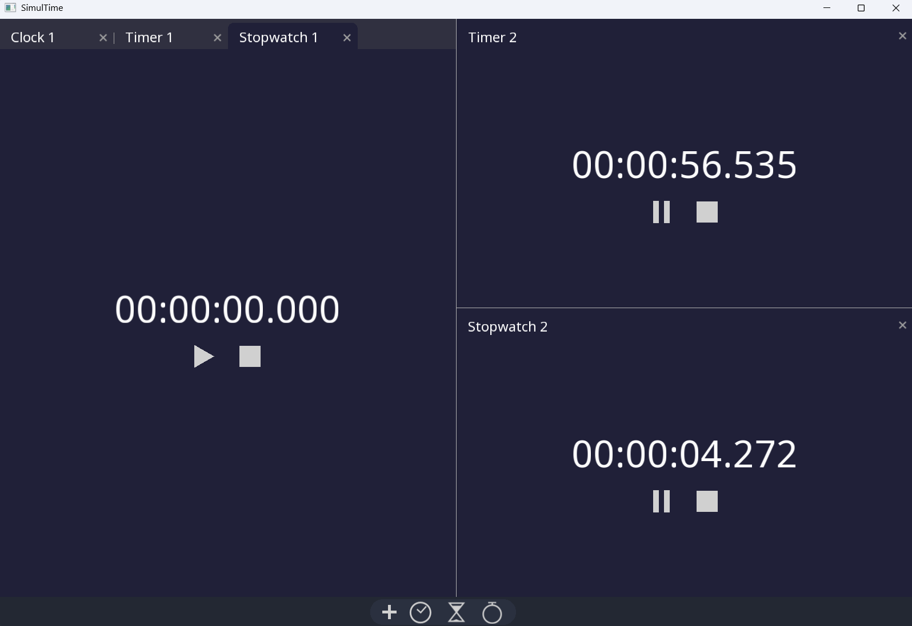

# SimulTime: clock, timer and stopwatch

Inspired by the fact that OS Clock apps don't let you set more than one stopwatch, SimulTime lets you have whatever clocks you want, in whatever arrangement you want.

This app was originally built as part of the [Handmade Essentials Jam 2026](https://handmade.network/jam/essentials) ([project page](https://handmade.network/p/800/simultime/)). As per the jam rules, no AI code generation was used in its creation(the library code in `autil/` was written before the jam, and did make minor use of AI assistance). Subsequent updates will continue to use no AI codegen.

Building
--------
This project depends on [SDL3](https://www.libsdl.org/) and [freetype](https://freetype.org).

### Windows

Run the build script in a [VS Developer Command Prompt](https://learn.microsoft.com/en-us/cpp/build/building-on-the-command-line?view=msvc-170). SDL3-static.lib and freetype.lib must be available in your PATH.

     > build.bat

### Linux

Run the build script. SDL3 and freetype libraries and headers must be installed(Ubuntu: `libsdl3-dev` and `libfreetype-dev`).

    $ build.sh